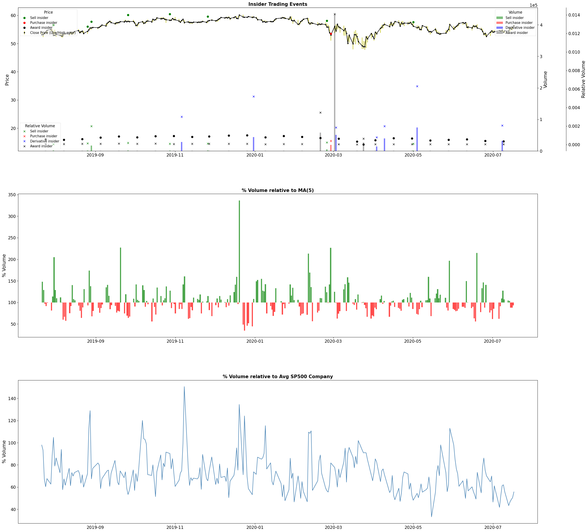
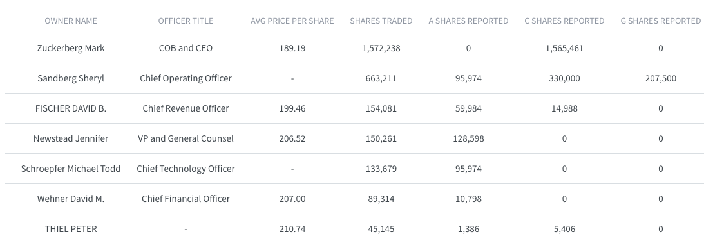
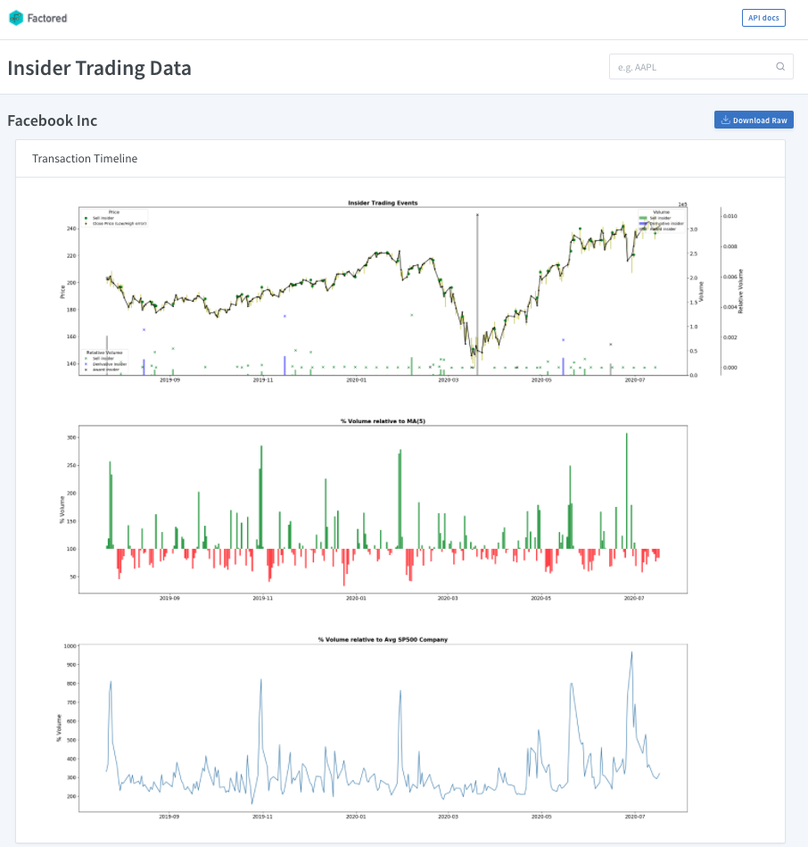

# Insider trading API

> Developed by **(Factored.AI)**

The Factored's Insider trading API is a web application that allows to easily get data from insider
trading transactions among the S&P 500 companies. With this tool a user can easily pull data directly from
the SEC and check the last insider's transactions. Such queries can come in raw form or as a dataset for a machine learning model (tensorflow dataset).

**This is an ongoing work**
# Documentation
## Insider Trading Information
The insider trading infromation comes from the [SEC Form 4](https://www.sec.gov/files/forms-3-4-5.pdf). Here is the description for the main transaction codes:

### Transaction Code Transaction:
- **A** - Grant, award, or other acquisition of securities from the company (such as an option)
    - May indicate certainty on results about the company
- **K** - Equity swaps and similar hedging transactions
- **P** - Purchase of securities on an exchange or from another person
    - Indicates additional purchase by some executive, may indicate good news or confidence about the company. And may have "privilege" information.
- **S** - Sale of securities on an exchange or to another person
    - Sales may indicate loss of confidence about the company, or just that some executives needed liquidity.
- **D** - Sale or transfer of securities back to the company
- **F** - Payment of exercise price or tax liability using portion of securities received from the company
- **M** - Exercise or conversion of derivative security received from the company (such as an option)
    - Mainly options for employees. They buy may be good indicator, as indicates internal confidence about the company.
- **G** - Gift of securities by or to the insider
    - Gift, donations, etc.
- **V** - A transaction voluntarily reported on Form 4
- **J** - Other (accompanied by a footnote describing the transaction)

Some transaction codes were ignored as they may not indicate good information (i. e. Gifts may not have any relation with company drivers, they are mostly donations or gifts to a family member). The relevant transaction codes are:
**A, P, M, S**. As they can have some relationship with company drivers or signal (i. e: A purchase from an insider is not common, as they usually have  stock options, awards, etc. So buying more shares in themarket may bring a positive signal for the company).

## Rest API  
We developed a web application with three endpoints: 

### **GET generate_plot/**
Retrieve an image showing relevant stats from insiders.
```bash
wget http://35.164.216.200:8000/generate_plot/{ticker_name}
```
#### Example image:
*Verizon*


This images have 3 subplots with a common time axis. 
1. **Insider Trading Events:** Which has 4 relevant plots. 
    - The daily stock close price data with High and Low price for each day. 
    - The insider *price* which is the average traded price for an insider transaction code during that day. This price is common for the Sell and Purchase codes. The options and awards may have a lower or zero price according to the company benfit poicies.
    - The insider *volume* which is the sum of the shares traded duirng that day for an specific transaction code.
    - The insider *relative volume* which is the proportion of the shares traded during that day relative to the daily total stock traded
2. **% Volume relative to MA(5):** Which indicates the relative volume to the moving average of the last 5 days.
3. **% Volume relative to Avg Sp500 Company:** Which indicates the relative volume to the average S&P500 Company.

This 3 subplots aree aligned to facilitate the cross analysis and found interesting patterns with the insider trading info.


### **GET generate_insiders_info/**
Create a table with all the insider transactions and the executives that executed them.
```bash
wget http://35.164.216.200:8000/generate_insiders_info/{ticker_name}
```

This table has the insider trader aggregated information for the period. Some general information is the avg price across transactions, total shares traded (within all transaction codes), sahres traded  per transaction code, etc.

### **GET raw_data/** 
Retrieves a time series with transctions and insider deals history. 
```bash
wget http://35.164.216.200:8000/raw_data/{ticker_name}
```

This data come as a daily time series `.csv` file with the  transaction historical data. For each transaction it is marked whether it was an insider deal or not and in case it was, the type and the insider are provided too. This end-point was tought as an easy way to get data for training machine learning models.

## User interface


In the current interface located at this [link](http://35.164.216.200:8080/) you can search for the insider trading for each company with its ticker.

The tickers available are:
- VZ  -  VERIZON COMMUNICATIONS INC
- AMZN  -  AMAZON COM INC
- AAPL  -  APPLE INC
- PFE  -  PFIZER INC
- PEP  -  PEPSICO INC
- GOOG  -  Alphabet Inc.
- WMT  -  Walmart Inc.
- CVX  -  CHEVRON CORP
- INTC  -  INTEL CORP
- MA  -  Mastercard Inc
- HD  -  HOME DEPOT, INC.
- MRK  -  Merck & Co., Inc.
- JNJ  -  JOHNSON & JOHNSON
- BAC  -  BANK OF AMERICA CORP /DE/
- LSXMK  -  Liberty Media Cor
- FB  -  Facebook Inc
- CRM  -  SALESFORCE COM INC
- COST  -  COSTCO WHOLESALE CORP /NEW
- TMO  -  THERMO FISHER SCIENTIFIC INC.
- MSFT  -  MICROSOFT CORP
- ABBV  -  AbbVie Inc.
- MCD  -  MCDONALDS CORP
- NFLX  -  NETFLIX INC
- ACN  -  Accenture plc
- T  -  AT&T INC.
- PYPL  -  PayPal Holdings, Inc.
- PG  -  PROCTER & GAMBLE Co
- XOM  -  EXXON MOBIL CORP
- ABT  -  ABBOTT LABORATORIES
- NVDA  -  NVIDIA CORP
- AMGN  -  AMGEN INC
- UNH  -  UNITEDHEALTH GROUP INC
- DIS  -  Walt Disney Co
- CSCO  -  CISCO SYSTEMS, INC.
- KO  -  COCA COLA CO
- ADBE  -  ADOBE INC.
- V  -  VISA INC.
- JPM  -  JPMORGAN CHASE & CO

## Data sources
The data is collected from two sources:

* [**yfinance**](https://github.com/ranaroussi/yfinance): This is an open source python API for download data from yahoo finance.
* [**secedgar**](https://github.com/sec-edgar/sec-edgar): An open source crawler that scrapes EDGAR, the SEC database. In this Data base are stored all number 4 forms, every insider deal done has as a requirement to be reported to the SEC, such reports are precisely the number 4 forms.


