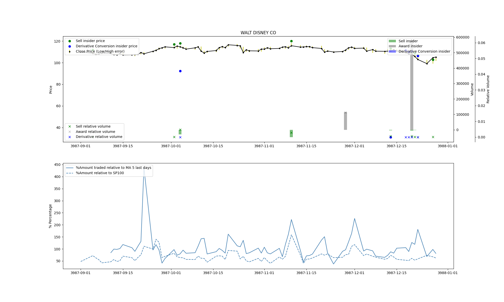

# Insider trading API

> Developed by **(Factored.AI)**

The Factored's Insider trading API is a webb application that allows to easily get data from insider
trading transactions among the S&P 100 companies. With this tool a user can easily pull data directly from
the SEC and check the last insider's transactions. Such queries can come either in the form of a graph or raw data for a machine learning model.

**This is an ongoing work**
# Documentation

## Rest API  
We develop a web application with three endpoints (all are get methods): 

### **generate_plot/**

Retrieve an image showing relevant stats from insiders.

```bash
wget http://35.164.216.200:8000/generate_plot/{ticker_name}
```
**Example image:**


### **generate_insiders_info/**
Create a table with all the insider transactions and the executives that executed them.

```bash
wget http://35.164.216.200:8000/generate_insiders_info/{ticker_name}
```

### **raw_data/** 
Retrieves a time series with transctions and insider deals history. 

```bash
wget http://35.164.216.200:8000/raw_data/{ticker_name}
```

This data come as a `.csv` file, this file come with a time series with the transactions historical data. For each transaction it is marked whether it was an insider deal or not and in case it was, the type and the insider are provided too. This end-point was tought as an easy way to get data for training machine learning models.

## User interface

....


## Data sources

The data is collected from two sources:

* [**yfinance**](https://github.com/ranaroussi/yfinance): This is an open source python API for download data from yahoo finance.
* [**secedgar**](https://github.com/sec-edgar/sec-edgar): An open source crawler that scrapes EDGAR, the SEC database. In this Data base are stored all number 4 forms, every insider deal done has as a requirement to be reported to the SEC, such reports are precisely the number 4 forms.


